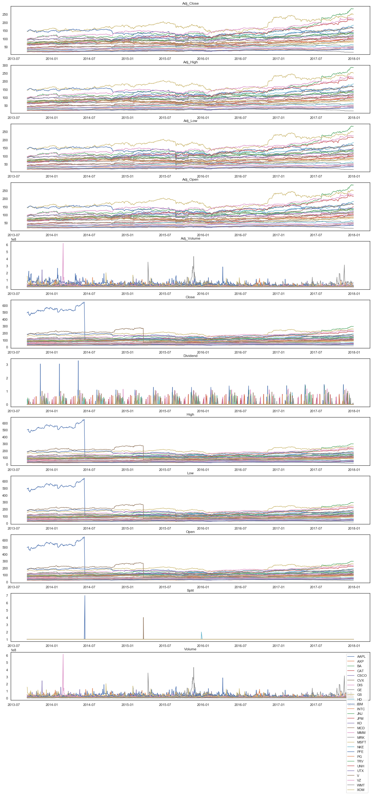
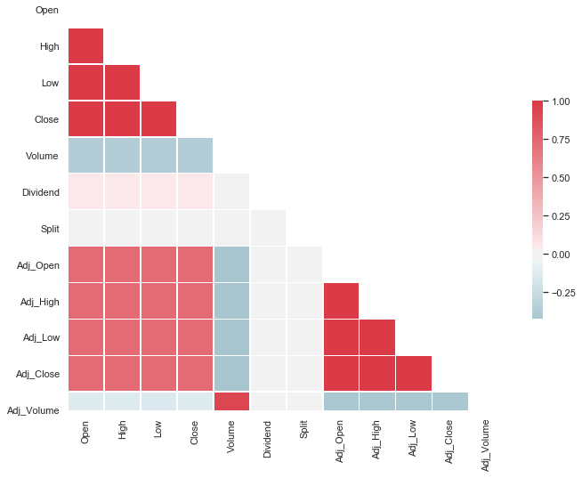
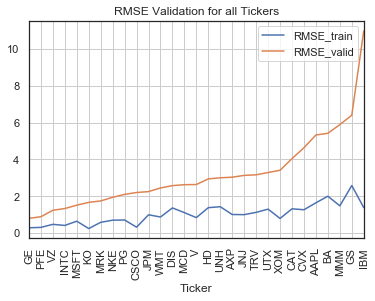

# Stock Price Indicator

## Project Overview


Investment firms, hedge funds and even individuals have been using financial models to better understand market behaviour and make profitable investments and trades. A wealth of information is available in the form of historical stock prices and company performance data, suitable for machine learning algorithms to process.


Here, I build a stock price predictor that takes daily trading data over a certain date range as input, and outputs projected estimates for given query dates. Inputs contain multiple metrics:

 * opening price (Open)
 * highest price the stock traded at (High)
 * how many stocks were traded (Volume)
   Whereas the prediction is made on:
 * closing price adjusted for stock splits and dividends (Adjusted Close)

We want to explore, where possible, S&P500 companies. The list of the listed companies is taken from [here](https://datahub.io/core/s-and-p-500-companies). 
The trading data comes from [Quandl End-of-Day US stock prices](https://www.quandl.com/data/EOD-End-of-Day-US-Stock-Prices) and it is downloaded through their [API](https://www.quandl.com/data/EOD-End-of-Day-US-Stock-Prices/usage/quickstart/api) and stored locally. Details are provided into the `Data Exploration` section below.

#### Project Format and Features

The project is developed by referring to the cross industry standard process for data mining (CRISP-DM) methodology. Here we summarise the steps undertaken:

- Business Understanding
- Data Understanding
- Data Preparation
- Modelling
- Evaluation
- Deployment

The project is developed in the form a written report.


## Problem Statement

The aim of the project is to predict stock's adjusted closing prices at 1, 7, 14 and 28 days, by giving stock data a time window of $n$ precedent days. The model should work for highly relevant companies, therefore a few from S&P500 are selected due to data availability.

Data is collected and wrangled to provide training and testing data in the format of features (open, min, max, close, split and dividend) and output vector (the adjusted closing price at the relative time shifts). Data is standardised and a experiments are conducted to test and improve performances.

## Metrics

I used Mean Squared Error to measure performance of the model during training. As a reminder, it is the mean of the squared difference between predicted and true values:

$RMSE=\frac{1}{n} \Sigma \sqrt{(Y_i - \hat{Y_i})^2}$

which is preferred to the mean absolute error due to its tendency to penalise more bigger errors. By doing so, The aim is to drive to model to avoid big errors rather than producing more equally distributed ones.

## Requirements

Requirements for the python environment can be found in the `requirements.yml` file associated with this repository.

<br/>

## Analysis

### Data Exploration

Features and calculated statistics relevant to the problem have been reported and discussed related to the dataset, and a thorough description of the input space or input data has been made. Abnormalities or characteristics about the data or input that need to be addressed have been identified.

</style>

<table border="1" class="dataframe">
  <thead>
    <tr style="text-align: right;">
      <th></th>
      <th>Date</th>
      <th>Open</th>
      <th>High</th>
      <th>Low</th>
      <th>Close</th>
      <th>Volume</th>
      <th>Dividend</th>
      <th>Split</th>
      <th>Adj_Open</th>
      <th>Adj_High</th>
      <th>Adj_Low</th>
      <th>Adj_Close</th>
      <th>Adj_Volume</th>
      <th>Ticker</th>
    </tr>
  </thead>
  <tbody>
    <tr>
      <th>0</th>
      <td>2017-12-28</td>
      <td>171.00</td>
      <td>171.850</td>
      <td>170.480</td>
      <td>171.08</td>
      <td>16480187.0</td>
      <td>0.0</td>
      <td>1.0</td>
      <td>165.971205</td>
      <td>166.796208</td>
      <td>165.466497</td>
      <td>166.048853</td>
      <td>16480187.0</td>
      <td>AAPL</td>
    </tr>
    <tr>
      <th>1</th>
      <td>2017-12-27</td>
      <td>170.10</td>
      <td>170.780</td>
      <td>169.710</td>
      <td>170.60</td>
      <td>21498213.0</td>
      <td>0.0</td>
      <td>1.0</td>
      <td>165.097672</td>
      <td>165.757675</td>
      <td>164.719142</td>
      <td>165.582968</td>
      <td>21498213.0</td>
      <td>AAPL</td>
    </tr>
    <tr>
      <th>2</th>
      <td>2017-12-26</td>
      <td>170.80</td>
      <td>171.470</td>
      <td>169.679</td>
      <td>170.57</td>
      <td>33185536.0</td>
      <td>0.0</td>
      <td>1.0</td>
      <td>165.777087</td>
      <td>166.427383</td>
      <td>164.689053</td>
      <td>165.553851</td>
      <td>33185536.0</td>
      <td>AAPL</td>
    </tr>
    <tr>
      <th>3</th>
      <td>2017-12-22</td>
      <td>174.68</td>
      <td>175.424</td>
      <td>174.500</td>
      <td>175.01</td>
      <td>16349444.0</td>
      <td>0.0</td>
      <td>1.0</td>
      <td>169.542983</td>
      <td>170.265103</td>
      <td>169.368277</td>
      <td>169.863278</td>
      <td>16349444.0</td>
      <td>AAPL</td>
    </tr>
    <tr>
      <th>4</th>
      <td>2017-12-21</td>
      <td>174.17</td>
      <td>176.020</td>
      <td>174.100</td>
      <td>175.01</td>
      <td>20949896.0</td>
      <td>0.0</td>
      <td>1.0</td>
      <td>169.047981</td>
      <td>170.843576</td>
      <td>168.980040</td>
      <td>169.863278</td>
      <td>20949896.0</td>
      <td>AAPL</td>
    </tr>
  </tbody>
</table>

</div>

#### Data Integrity and statistics

    Date          0
    Open          0
    High          0
    Low           0
    Close         0
    Volume        0
    Dividend      0
    Split         0
    Adj_Open      0
    Adj_High      0
    Adj_Low       0
    Adj_Close     0
    Adj_Volume    0
    Ticker        0
    dtype: int64

And statistics result reasonable. More specifically:

* `Open`, `High`, `Low` and `Close` show similar mean and standard deviation, as we would expect from daily data. Also the`Adj_*` relative ones report a similar trend.
* `Dividend` is mostly zero, which makes sense as these are usually distributed monthly, quarterly or annually. Therefore, most of the daily data points should be zero.
* `Split` report whether stocks are split in the event of high price. This is quite of a rare event to happen, so it is reasonable that no split are present throughout almost all our data points. It is worth noting that  no aggregation is performed in this dataset, as there are no data points with a split value less than 1.

</style>

<table border="1" class="dataframe">
  <thead>
    <tr style="text-align: right;">
      <th></th>
      <th>Open</th>
      <th>High</th>
      <th>Low</th>
      <th>Close</th>
      <th>Volume</th>
      <th>Dividend</th>
      <th>Split</th>
      <th>Adj_Open</th>
      <th>Adj_High</th>
      <th>Adj_Low</th>
      <th>Adj_Close</th>
      <th>Adj_Volume</th>
    </tr>
  </thead>
  <tbody>
    <tr>
      <th>count</th>
      <td>31610</td>
      <td>31610</td>
      <td>31610</td>
      <td>31610</td>
      <td>31610</td>
      <td>31610</td>
      <td>31610</td>
      <td>31610</td>
      <td>31610</td>
      <td>31610</td>
      <td>31610</td>
      <td>31610</td>
    </tr>
    <tr>
      <th>mean</th>
      <td>95.491669</td>
      <td>96.171887</td>
      <td>94.818211</td>
      <td>95.521521</td>
      <td>1.226938e+07</td>
      <td>0.009154</td>
      <td>1.000316</td>
      <td>81.437157</td>
      <td>82.014518</td>
      <td>80.866317</td>
      <td>81.463475</td>
      <td>1.286934e+07</td>
    </tr>
    <tr>
      <th>std</th>
      <td>59.333158</td>
      <td>59.766797</td>
      <td>58.916946</td>
      <td>59.355129</td>
      <td>1.500732e+07</td>
      <td>0.085350</td>
      <td>0.038147</td>
      <td>43.340742</td>
      <td>43.637986</td>
      <td>43.056648</td>
      <td>43.358424</td>
      <td>1.609089e+07</td>
    </tr>
    <tr>
      <th>min</th>
      <td>17.350000</td>
      <td>17.400000</td>
      <td>17.250000</td>
      <td>17.360000</td>
      <td>3.053580e+05</td>
      <td>0.000000</td>
      <td>1.000000</td>
      <td>16.190719</td>
      <td>16.250819</td>
      <td>16.102600</td>
      <td>16.186081</td>
      <td>3.053580e+05</td>
    </tr>
    <tr>
      <th>25%</th>
      <td>55.372500</td>
      <td>55.870000</td>
      <td>54.980000</td>
      <td>55.395000</td>
      <td>3.847515e+06</td>
      <td>0.000000</td>
      <td>1.000000</td>
      <td>47.642711</td>
      <td>48.065195</td>
      <td>47.263770</td>
      <td>47.650090</td>
      <td>4.104089e+06</td>
    </tr>
    <tr>
      <th>50%</th>
      <td>87.845000</td>
      <td>88.400000</td>
      <td>87.170000</td>
      <td>87.840000</td>
      <td>7.197633e+06</td>
      <td>0.000000</td>
      <td>1.000000</td>
      <td>76.139854</td>
      <td>76.664216</td>
      <td>75.628460</td>
      <td>76.147526</td>
      <td>7.490536e+06</td>
    </tr>
    <tr>
      <th>75%</th>
      <td>118.560000</td>
      <td>119.290000</td>
      <td>117.707500</td>
      <td>118.580000</td>
      <td>1.526566e+07</td>
      <td>0.000000</td>
      <td>1.000000</td>
      <td>105.912443</td>
      <td>106.673449</td>
      <td>105.180398</td>
      <td>105.948241</td>
      <td>1.574847e+07</td>
    </tr>
    <tr>
      <th>max</th>
      <td>649.900000</td>
      <td>651.260000</td>
      <td>644.470000</td>
      <td>647.350000</td>
      <td>6.166205e+08</td>
      <td>3.290000</td>
      <td>7.000000</td>
      <td>286.481931</td>
      <td>286.913264</td>
      <td>284.785353</td>
      <td>285.542583</td>
      <td>6.166205e+08</td>
    </tr>
  </tbody>
</table>

</div>

#### Timeframe

The time frame available from Quandl dataset is equal for all the stocks, and spans through 1577 days from 03/09/2013 until 28/12/2017 (see: appendix, table A.1).

<br/>

### Data Visualization

Here, all the time-series are plotted by feature. It is noticeable how the split on a few companies, most relevantly Apple (AAPL, blue) and Chevron Corporation (CVX, brown), affect the stock price and the dividend.




#### Features correlation

Here we plot the correlation matrix of our dataset. It is noticeable how prices are strongly correlated (we would not expect anything much different within a day)  and how volume shows the opposite trend with price.




<br/>


# Methodology

## Data Pre-processing

Pre-processing steps consist of a series of steps, applied per each ticker series in the dataset:
* **feature engineering**: adding technical indicators to enhance the input data.
* **windowing**: as the data comes in the form of a time series, it is required to be stored as an time-related array of features.
* **closing price projection**: we extract the adjusted closing price for each window, at 1, 7, 14 and 28 days.
* **scaling (standardization)**: whereas stock prices and dividends are of similar nature (currency), volume and split occur at a different unit.<br/>*NOTE*: the scaling is applied at the whole dataset, regardless of the ticker.
* **train-test split**: train and test datasets are created in a ratio of 70-30, where the 30 represent the last 30% of the series to avoid [look-ahead bias](https://www.investopedia.com/terms/l/lookaheadbias.asp)


### Technical Indicators for Feature Engineering

A series of indicators are engineered to provide more features to the dataset.

#### Relative Strength Index (RSI)

The [RSI]( https://en.wikipedia.org/wiki/Relative_strength_index ) indicates the current and historical strength of a traded stock, based on the closing prices over a recent period. It is calculated by measuring the velocity and magnitude of oscillation, reason why it is classified as a momentum oscillator.

$RSI = 100 - \frac{100}{1 + \frac{EMA(U,n)}{EMA(D,n)}}$

where 

* $EMA$ is the exponential moving average over a period $n$
* $U$ is the upward change
* $D$ is the downward change

```python
def calculate_RSI(df, window=5):
    # gett al differences and separate positive and negative
    df_diff = df.diff()
    gain, loss = df_diff.copy(), df_diff.copy()
    gain[gain < 0] = 0 # set neg to zero
    loss[loss > 0] = 0 # set pos to zero
    # calc mean gains and losses
    av_gain = gain.ewm(com=window,adjust=False).mean()
    av_loss = loss.ewm(com=window, adjust=False).mean().abs()
    # RSI
    rsi = 100 - 100 / (1 + av_gain / av_loss)
    return rsi
```

<br/>

#### Simple Moving Average (SMA)

The [SMA](  https://www.investopedia.com/terms/s/sma.asp ) is the arithmetic average calculated over a period

```python
def calculate_SMA(df, window=5):
    # Simple Moving Average
    SMA = df.rolling(window=window, min_periods=window, center=False).mean()
    return SMA
```

<br/>

#### Bollinger Bands (BB)

The [Bollinger Bands]( https://en.wikipedia.org/wiki/Bollinger_Bands ) characterise the volatility of a financial instrument or commodity by defining its likely upper and lower bounds. The measure is based on the $SMA$ and the standard deviation $K \sigma$ over a window period $N$, typically 20 data points. $K$ is typically 2.

```python
def calculate_BB(df, window=5):
    # Bollinger Bands @ mean-/+2*st_dev
    # calc st_dev and mean
    STD = df.rolling(window=window,min_periods=window, center=False).std()
    SMA = calculate_SMA(df)
    upper_band = pd.DataFrame(SMA.values + (2 * STD.values),columns=df.columns)
    lower_band = pd.DataFrame(SMA.values - (2 * STD.values),columns=df.columns)
    return upper_band,lower_band
```

<br/>

### Windowing

The predict the closing price of a stock is required at 1,7,14 and 28 days ahead in time. To do so,  the prediction is based on $w$ previous days, the period window. Since our dataset is is made of end-of-day data, this corresponds to the number of previous days the prediction is based on.

Moreover, the process is executed on each company registered in the initial dataset.

Pseudocode:


```
def preprocess_data(data, window=8):
	# output variables
	X, y, tickers, dates = [],[],[],[]
	
    # Set a Technical Indicators window
    TI_window = window
	
	# Group by company
    groups = data.groupby('Tickers')
    
    for name,group in groups:
    	# Technical Indicators
        group = group + group['Adj_Close']-group['Adj_Open'])/group['Adj_Open'] # returns
        group = group + calculate_RSI(group[prices],window=TI_window)
        group = group + calculate_SMA(group[prices],window=TI_window)
        group = group + calculate_BB(group[prices],window=TI_window)        
        # calculate the start
        # jump ahead of the window and the technical_window
        start = (window-1)+(TI_window-1)
        for i in range(start, len(group)-28):
            # drop and transform X
            data = group[i-(window-1):i+1]
            # transform y - remember to increase dimensionality of the array
            pred = [
            	group[i+1,y_label], 
            	group[i+7,y_label],
                group[i+14,y_label],
                group[i+28,y_label]
                ]
            # done
            X.append(data)
            y.append(pred)
            tickers.append(name)
            dates.append(group[i]['Date'])
    return X, y, tickers, dates

```

Here we report the dataset shapes in case of a window of 8 days (and so the technical window):

| S            | y          | tickers  | dates    |
| ------------ | ---------- | -------- | -------- |
| (30384, 304) | (30384, 4) | (30384,) | (30384,) |

<br/>


### Scaling

Here we scale the whole dataset through a standard scaler; the data will had mean $\mu=0.0$ and standard deviation $\sigma=1.0$.

<br/>

### Train-Test  and Validation split

The split is performed to avoid look-ahead bias. Therefore, for each company, the data is split into two dataset accordingly to two periods in time: 

* First period (training and test),will be used to train the model by cross-validation.

* A following period (validation), which is a part of the data the model has never seen and therefore needs to be the ending part of the dataset.

Here we report an example for `'AAPL'` stock dataset with a training ratio of 0.7:

| X_train    | X_validation | y_train  | y_validation |
| ---------- | ------------ | -------- | ------------ |
| (728, 304) | (312, 304)   | (728, 4) | (312, 4)     |

<br/>


## Implementation

A standard process is developed in order to process a object which implements `.fit(X,y)` method through a series of steps; it can be a model, grid-search or pipeline.
* The whole dataset is split between train and validation sets, by company.
* The object is fit on all the re-combined training data.
* A final validation is conducted against the whole validation set. Performance data is stored relatively to the metric chosen, the RMSE.

We run this process in three instances:
 1. **Benchmark Model**: a decision tree regressor with scikit-learn standard parameters is used as a benchmark model.
 2. **Model Testing**: a series of selected models (see below): models are fit and evaluated
 3. **Refinements**: pipelines to improve selected models through grid-search are used to perform cross-validation over the time series.


The objective output is a 4-class vector which represent the closing stock price at 1,7,14 and 28 days.

Eventually, 4 different models which handle 1-d output might be trained for the scope. Here, Grid-Search is not performed yet, as it might lead to a data leak due to the previous scaling. Mean squared error is used to evaluate the model performances on the training and test sets. <br/>
The first run produces a model whose performances show a clear overfitting (MSE on training is about 6 times lower than the MSE on the test set).

Here, the pseudocode for the above-mentioned processes is laid down. For the extensive code and docstrings, you might want to refer to the project repository.

```
def fit_on_all_data(mdl, X, y, train_percentage=0.7):
    """ PSEUDOCODE
    """
    X_t, X_v, _, _, _ = gen_train_test_and_valid_data(unique_tickers[0], X, y, train_percentage)
    xt = np.array(X_t)
    yt = np.array(y_t)
    xv = np.array(X_v)
    yv = np.array(y_v)
    for t in unique_tickers[1:]:
        X_t, X_v, _, _, _ = gen_train_test_and_valid_data(t, X, y,0.7)
        xt = np.concatenate((xt,X_t))
        yt = np.concatenate((yt,y_t))
    mdl.fit(xt, yt)
    return mdl
```


```
def validate_model(model, X, y, ticker, plot=True, print_output=True, ts_split=0.7):
    """ PSEUDOCODE
    """
    X_train, X_valid, y_train, y_valid, dates = gen_train_test_and_valid_data(ticker, X, y, ts_split=ts_split)
    # predictions
    y_pred_train = model.predict(X_train)
    y_pred_valid = model.predict(X_valid)
    # performances - scale inverse
    rmse_train = np.sqrt(mean_squared_error(y_train, y_pred_train))
    rmse_valid = np.sqrt(mean_squared_error(y_valid, y_pred_valid))
    if print_output:
        print('{:=^50}'.format("VALIDATION FOR "+ticker))
        print("TRAIN RMSE:    ",rmse_train)
        print("VALID RMSE:    ",rmse_valid)
    
    if plot:
        fig,axs = plt.subplots(2,2,figsize=(16,8))
        days=[1,7,14,28]
        for i in range(len(axs)):
            for j in range(len(axs[i])):
                idx = j + i*(len(axs[i]))
                y_1=y_pred_valid.T[idx]
                y_2=y_valid.T[idx]
                x=np.arange(y_1.shape[0])
                axs[i][j].plot(x,y_1,label='pred')
                axs[i][j].plot(x,y_2,label='truth')
                axs[i][j].set_title('Adjusted Close Price @ {} days'.format(days[idx]))
                axs[i][j].legend()
        plt.show();
    return rmse_train, rmse_valid
```


```
def validate_on_all_data(model, X, y, ts_split=0.7):
    """ PSEUDOCODE
    """
    results = []
    for t in unique_tickers:
        r1,r2 = validate_model(model, X, y, t, plot=plot_singles)
        results.append([r1,r2])
    results = results.transpose()
    # create a df for results and plot from most to least predictable ticker
    res = pd.DataFrame({'Ticker':unique_tickers,
                        'RMSE_train':results[0],
                        'RMSE_valid':results[1]})
    res = res.sort_values(by='RMSE_valid')
    return res
```

<br/>

### Benchmark Model

Scikit-learn's `DecisionTreeRegressor` with default parameters is used as the benchmark model for this project. Results are reported in table A.2 in the appendix and plotted here:


<div>
<style scoped>
    .dataframe tbody tr th:only-of-type {
        vertical-align: middle;
    }
Here, The best (lowest), median and worst (highest) loss relative to the predicted closing stock prices are pick and plotted.


<table border="1" class="dataframe">
  <thead>
    <tr style="text-align: right;">
      <th></th>
      <th>Ticker</th>
      <th>RMSE training</th>
      <th>RMSE validation</th>
    </tr>
  </thead>
  <tbody>
    <tr>
      <th>Low Loss</th>
      <td>GE</td>
      <td>0.0</td>
      <td>0.939871</td>
    </tr>
    <tr>
      <th>Avg Loss</th>
      <td>WMT</td>
      <td>0.0</td>
      <td>3.649151</td>
    </tr>
    <tr>
      <th>High Loss</th>
      <td>IBM</td>
      <td>0.0</td>
      <td>24.124613</td>
    </tr>
  </tbody>
</table>

#### GE (lowest loss)


#### WMT (median loss)


#### IBM (highest loss)


<br/>


### Models testing

Here we test a series of models and we try to improve them by applying grid search.

1. Random Forest Regressor

2. Stochastic Gradient Descent (multi-output)

3. Support Vector Regressor (multi-output)

4. Multi-output Lasso 

5. Ridge

Models performances are reported in detail below. Details are reported in the appendix table A.3.

#### 1. Random Forest Regressor



#### 2. Multi-Output Stochastic Gradient Descent


#### 3. Multi-Output Support Vector Regressor


#### 4. Multi-Task Lasso


#### 5. Ridge


#### Overall Validation Loss

The cumulative validation loss is calculated for each model across all the tickers as shown below. Lasso, Random Forest and Ridge perform similarly, with a clear tendency of the second to overfit. The Support Vector Regressor is still comparable, albeit reporting a performance 50% worse. Finally, the SGD reports extremely poor results.

<table border="1" class="dataframe">
  <thead>
    <tr style="text-align: right;">
      <th></th>
      <th>training RMSE</th>
      <th>validation RMSE</th>
    </tr>
  </thead>
  <tbody>
    <tr>
      <th>Lasso (4)</th>
      <td>96.00</td>
      <td>76.28</td>
    </tr>
    <tr>
      <th>Random Forest (1)</th>
      <td>29.66</td>
      <td>92.71</td>
    </tr>
    <tr>
      <th>Ridge (5)</th>
      <td>90.90</td>
      <td>99.99</td>
    </tr>
    <tr>
      <th>SVR (3)</th>
      <td>158.90</td>
      <td>140.63</td>
    </tr>
    <tr>
      <th>SGD (2)</th>
      <td>2115.57</td>
      <td>4317.60</td>
    </tr>
  </tbody>
</table>


#### Model Testing - Conclusion

Model testing suggest that further development might be worth for models 4, 1 and 5; especially model 1 might improve its performance by fine tuning its hyper-parameters (e.g. n_estimators, max_depth, etc).

For limitation in training time (here not reported), as well as in poorer results, model 3 will be discarded. Moreover, model 2 is also discarded for poor results.

<br/>


## Refinements

To avoid overfitting, I repeat what above, but by building a pipeline object which comprehends a scaler to then perform a grid search to tune the hyper-parameters. Therefore, the windowing is done again, but omitting the scaling. Here we have a list of the models trained as well as the parameters to search for.

```python
p1 = Pipeline([
    ('scaler', StandardScaler()),
    ('reg', RandomForestRegressor())
])
s1 = {
    'reg__n_estimators':[10,15],
    'reg__max_depth':[4,8,16],
    'reg__max_features':['auto','sqrt','log2']
}
p2 = Pipeline([
    ('scaler', StandardScaler()),
    ('reg', MultiOutputRegressor(SGDRegressor()))
])
s2 = {
    'reg__estimator__max_iter':[1000,2000],
    'reg__estimator__epsilon': [0.5,0.1,0.02],
}
p3 = Pipeline([
    ('scaler', StandardScaler()),
    ('reg', MultiOutputRegressor(SVR(gamma='auto')))
])
s3 = {
    'reg__estimator__C': [0.5,1.0],
    'reg__estimator__epsilon': [0.3,0.1],
}
p3.get_params()
```


The Random Forest reports a more balanced score between validation and training set, and so it does the Stochastic Gradient Descent. The Multi-Output Support Vector Regressor improves generally of a small amount. Values are reported in table A.4 in the appendix.

#### Random Forest Regressor


#### SGD


#### Multi-Output Support Vector Regressor


<br/>


# Results

### Model Evaluation and Validation

The model is evaluated against its ability to predict returns. The returns at 1,7,14 and 28 days are calculated for the truth and the predicted prices. Then, their difference is analysed in order to show the error. More specifically:
* The mean of the difference shows if our model has the tendency to produce pessimistic/optimistic prices in the case of a predominant negative or positive error.
* The standard deviation of the difference shows how confident we can be about the model's outcome. It appears that the model requires outstanding improvements before being taken seriously, as we discuss the results below.


#### Data Frame for Returns

Here, we store the returns into a data frame, reporting truth, predicted and difference (error) values.

<div>
<style scoped>
    .dataframe tbody tr th:only-of-type {
        vertical-align: middle;
    }

</style>

<table border="1" class="dataframe">
  <thead>
    <tr style="text-align: right;">
      <th></th>
      <th>truth - 1 day</th>
      <th>truth - 7 days</th>
      <th>truth - 14 days</th>
      <th>truth - 28 days</th>
      <th>predicted - 1 day</th>
      <th>predicted - 7 day</th>
      <th>predicted - 14 day</th>
      <th>predicted - 28 day</th>
      <th>error - 1 day</th>
      <th>error - 7 days</th>
      <th>error - 14 days</th>
      <th>error - 28 days</th>
      <th>Ticker</th>
      <th>Date</th>
    </tr>
  </thead>
  <tbody>
    <tr>
      <th>0</th>
      <td>0.212436</td>
      <td>-0.861228</td>
      <td>-1.332032</td>
      <td>0.618887</td>
      <td>-0.727841</td>
      <td>-2.320279</td>
      <td>-3.770112</td>
      <td>-6.087364</td>
      <td>-0.940277</td>
      <td>-1.459051</td>
      <td>-2.438080</td>
      <td>-6.706251</td>
      <td>AAPL</td>
      <td>2017-12-20</td>
    </tr>
    <tr>
      <th>1</th>
      <td>0.886373</td>
      <td>-3.145194</td>
      <td>-3.082290</td>
      <td>0.421240</td>
      <td>-0.735464</td>
      <td>-2.458878</td>
      <td>-3.753820</td>
      <td>-5.201164</td>
      <td>-1.621837</td>
      <td>0.686316</td>
      <td>-0.671530</td>
      <td>-5.622403</td>
      <td>AAPL</td>
      <td>2017-12-19</td>
    </tr>
    <tr>
      <th>2</th>
      <td>-0.605610</td>
      <td>-3.262298</td>
      <td>-1.119808</td>
      <td>-0.484625</td>
      <td>-1.190879</td>
      <td>-2.911703</td>
      <td>-4.182123</td>
      <td>-6.119410</td>
      <td>-0.585269</td>
      <td>0.350595</td>
      <td>-3.062315</td>
      <td>-5.634785</td>
      <td>AAPL</td>
      <td>2017-12-18</td>
    </tr>
    <tr>
      <th>3</th>
      <td>-1.521043</td>
      <td>-3.356587</td>
      <td>-0.451738</td>
      <td>-0.718336</td>
      <td>-0.671276</td>
      <td>-2.820702</td>
      <td>-4.447407</td>
      <td>-6.382866</td>
      <td>0.849767</td>
      <td>0.535885</td>
      <td>-3.995668</td>
      <td>-5.664530</td>
      <td>AAPL</td>
      <td>2017-12-15</td>
    </tr>
    <tr>
      <th>4</th>
      <td>-0.783275</td>
      <td>-2.297990</td>
      <td>0.771756</td>
      <td>-1.007854</td>
      <td>-0.635755</td>
      <td>-2.910702</td>
      <td>-4.789407</td>
      <td>-7.153317</td>
      <td>0.147520</td>
      <td>-0.612712</td>
      <td>-5.561163</td>
      <td>-6.145463</td>
      <td>AAPL</td>
      <td>2017-12-14</td>
    </tr>
  </tbody>
</table>

</div>


<div>
<style scoped>
    .dataframe tbody tr th:only-of-type {
        vertical-align: middle;
    }


</style>

<table border="1" class="dataframe">
  <thead>
    <tr style="text-align: right;">
      <th></th>
      <th>truth - 1 day</th>
      <th>truth - 7 days</th>
      <th>truth - 14 days</th>
      <th>truth - 28 days</th>
      <th>predicted - 1 day</th>
      <th>predicted - 7 day</th>
      <th>predicted - 14 day</th>
      <th>predicted - 28 day</th>
      <th>error - 1 day</th>
      <th>error - 7 days</th>
      <th>error - 14 days</th>
      <th>error - 28 days</th>
    </tr>
  </thead>
  <tbody>
    <tr>
      <th>count</th>
      <td>30653.000000</td>
      <td>30653.000000</td>
      <td>30653.000000</td>
      <td>30653.000000</td>
      <td>30653.000000</td>
      <td>30653.000000</td>
      <td>30653.000000</td>
      <td>30653.000000</td>
      <td>30653.000000</td>
      <td>30653.000000</td>
      <td>30653.000000</td>
      <td>30653.000000</td>
    </tr>
    <tr>
      <th>mean</th>
      <td>-0.064943</td>
      <td>-0.349022</td>
      <td>-0.660375</td>
      <td>-1.253191</td>
      <td>-0.075783</td>
      <td>-0.395773</td>
      <td>-0.720014</td>
      <td>-1.310647</td>
      <td>-0.010840</td>
      <td>-0.046751</td>
      <td>-0.059639</td>
      <td>-0.057456</td>
    </tr>
    <tr>
      <th>std</th>
      <td>1.390063</td>
      <td>3.087831</td>
      <td>4.229838</td>
      <td>5.919779</td>
      <td>0.757015</td>
      <td>1.101838</td>
      <td>1.511708</td>
      <td>2.282970</td>
      <td>1.475334</td>
      <td>2.918211</td>
      <td>3.888233</td>
      <td>5.274306</td>
    </tr>
    <tr>
      <th>min</th>
      <td>-10.403576</td>
      <td>-15.705247</td>
      <td>-18.640535</td>
      <td>-27.767035</td>
      <td>-3.191394</td>
      <td>-9.492615</td>
      <td>-13.092403</td>
      <td>-18.420814</td>
      <td>-12.302254</td>
      <td>-17.464980</td>
      <td>-20.847822</td>
      <td>-31.670533</td>
    </tr>
    <tr>
      <th>25%</th>
      <td>-0.749415</td>
      <td>-2.114191</td>
      <td>-3.228079</td>
      <td>-5.100384</td>
      <td>-0.550256</td>
      <td>-1.030045</td>
      <td>-1.554728</td>
      <td>-2.515277</td>
      <td>-0.831855</td>
      <td>-1.704684</td>
      <td>-2.388989</td>
      <td>-3.310895</td>
    </tr>
    <tr>
      <th>50%</th>
      <td>-0.082707</td>
      <td>-0.439099</td>
      <td>-0.825059</td>
      <td>-1.607244</td>
      <td>-0.119782</td>
      <td>-0.482586</td>
      <td>-0.853464</td>
      <td>-1.451513</td>
      <td>-0.050504</td>
      <td>-0.051499</td>
      <td>-0.011622</td>
      <td>0.124476</td>
    </tr>
    <tr>
      <th>75%</th>
      <td>0.583501</td>
      <td>1.263256</td>
      <td>1.706667</td>
      <td>2.224064</td>
      <td>0.346963</td>
      <td>0.162219</td>
      <td>0.001345</td>
      <td>-0.267282</td>
      <td>0.767735</td>
      <td>1.665457</td>
      <td>2.341498</td>
      <td>3.371887</td>
    </tr>
    <tr>
      <th>max</th>
      <td>18.741436</td>
      <td>21.471487</td>
      <td>29.706575</td>
      <td>40.148487</td>
      <td>13.115996</td>
      <td>14.559105</td>
      <td>17.132684</td>
      <td>26.654802</td>
      <td>11.329396</td>
      <td>16.825680</td>
      <td>18.145165</td>
      <td>22.713002</td>
    </tr>
  </tbody>
</table>

</div>


### Justification

Here, the final results are discussed in detail. We focus on the difference between predicted and true returns. As previously stated, we look at its mean to evaluate if our model has the tendendcy to produce pessimistic/optimistic prices in the case of a predominant negative or positive error. Its standard deviation helps us in calculating the confidence interval of the produced prediction.

Mean and 95% confidence intervals are plotted below. The error at 1 day shows how the return might be wrong by a nominal -3/+3%. This is quite a lot, so to have an useful guess, we should look for a predicted outcome >3% (albeit further considerations are required). This makes the model being hardly useful as increments >3% in one day refers to quite specific events. A behavioural approach to investment might be considered in such case, however, the model could help in supporting that.

Then, the confidence intervals at 7, 14 and 28 days increase steadily by a further 30% for each days, making the model quite ineffective. We want also to plot a few examples about the returns, to see if it is possible to notice any patterns.


Here, returns are plotted for 3 companies. The model produces much stable outputs compared to the real returns.


```python
show_returns(['AAPL','AXP','CAT'],0)
```


## Conclusion

### Reflection

The end-to-end product of this project tries to bring together historical data about some of the S&P500 companies, where available through Quandl API. The data did not present inconsistencies, nor missing values, requiring only standard scaling practice before proceeding through picking a model to train and test. 

The selection fell on scikit-learn's random forest regressor. An initial overfitting happened due to lack of tuning hyper parameters, corrected by performing a grid search, and training the model through cross-validation (this was possible by creating a pipeline in order to avoid data leaks on cross validation).

Results were tested against analysing rate on returns, or RoR, and so by comparing the predicted with true returns. By doing so, it was possible to define a confidence interval relative to each time range. 7-days returns shows a 95% confidence interval of about -/+7% which is above the project's guidelines. Problems like reliable stock predictors requires a continuous implementation to keep the system effective by constantly digesting last-day data. In fact, by far the result has to be considered good in real-world business scenario.

Developing knowledge of time series as well as of investment principles and returns calculation was one of the most interesting aspect of the project. 

### Improvement

The nature of the problem, as well as the data here digested presents a high degree of non-linearity. Improvements to the system can be made by choosing a different model (e.g. SVM regressor to be trained on each time range) which is more prone to capture highly non-linear patterns. Eventually, going for a deep neural network might help: nlp-oriented techniques such as RNN or LSTM might be used to also include the temporality of the data (here, the window is digested as a flat vector by the model).

Then, further feature engineering might be required. For instance, returns might be included. Moreover, company-specific indices might help in determining the volatility of the company, or their financial status such as quarterly reports data. Moreover, such data should be daily added by undertaking incremental learning strategies in order to keep the model up-to-date.

Finally, test of the window size might be run in order to see how this affect our model. However, to avoid increasing the dimensionality of data too much without providing a time-related approach to train our model (such in the case of a LSTM), might produce worse rather than better results.

<br/>

<br/>

# Appendix

Table A.1 - Time frame for each company in the dataset.

<div>
<style scoped>
    .dataframe tbody tr th:only-of-type {
        vertical-align: middle;
    }
</style>
<table border="1" class="dataframe">
  <thead>
    <tr style="text-align: right;">
      <th></th>
      <th>start date</th>
      <th>end date</th>
      <th>difference</th>
    </tr>
    <tr>
      <th>Ticker</th>
      <th></th>
      <th></th>
      <th></th>
    </tr>
  </thead>
  <tbody>
    <tr>
      <th>AAPL</th>
      <td>2013-09-03</td>
      <td>2017-12-28</td>
      <td>1577 days</td>
    </tr>
    <tr>
      <th>AXP</th>
      <td>2013-09-03</td>
      <td>2017-12-28</td>
      <td>1577 days</td>
    </tr>
    <tr>
      <th>BA</th>
      <td>2013-09-03</td>
      <td>2017-12-28</td>
      <td>1577 days</td>
    </tr>
    <tr>
      <th>CAT</th>
      <td>2013-09-03</td>
      <td>2017-12-28</td>
      <td>1577 days</td>
    </tr>
    <tr>
      <th>CSCO</th>
      <td>2013-09-03</td>
      <td>2017-12-28</td>
      <td>1577 days</td>
    </tr>
    <tr>
      <th>CVX</th>
      <td>2013-09-03</td>
      <td>2017-12-28</td>
      <td>1577 days</td>
    </tr>
    <tr>
      <th>DIS</th>
      <td>2013-09-03</td>
      <td>2017-12-28</td>
      <td>1577 days</td>
    </tr>
    <tr>
      <th>GE</th>
      <td>2013-09-03</td>
      <td>2017-12-28</td>
      <td>1577 days</td>
    </tr>
    <tr>
      <th>GS</th>
      <td>2013-09-03</td>
      <td>2017-12-28</td>
      <td>1577 days</td>
    </tr>
    <tr>
      <th>HD</th>
      <td>2013-09-03</td>
      <td>2017-12-28</td>
      <td>1577 days</td>
    </tr>
    <tr>
      <th>IBM</th>
      <td>2013-09-03</td>
      <td>2017-12-28</td>
      <td>1577 days</td>
    </tr>
    <tr>
      <th>INTC</th>
      <td>2013-09-03</td>
      <td>2017-12-28</td>
      <td>1577 days</td>
    </tr>
    <tr>
      <th>JNJ</th>
      <td>2013-09-03</td>
      <td>2017-12-28</td>
      <td>1577 days</td>
    </tr>
    <tr>
      <th>JPM</th>
      <td>2013-09-03</td>
      <td>2017-12-28</td>
      <td>1577 days</td>
    </tr>
    <tr>
      <th>KO</th>
      <td>2013-09-03</td>
      <td>2017-12-28</td>
      <td>1577 days</td>
    </tr>
    <tr>
      <th>MCD</th>
      <td>2013-09-03</td>
      <td>2017-12-28</td>
      <td>1577 days</td>
    </tr>
    <tr>
      <th>MMM</th>
      <td>2013-09-03</td>
      <td>2017-12-28</td>
      <td>1577 days</td>
    </tr>
    <tr>
      <th>MRK</th>
      <td>2013-09-03</td>
      <td>2017-12-28</td>
      <td>1577 days</td>
    </tr>
    <tr>
      <th>MSFT</th>
      <td>2013-09-03</td>
      <td>2017-12-28</td>
      <td>1577 days</td>
    </tr>
    <tr>
      <th>NKE</th>
      <td>2013-09-03</td>
      <td>2017-12-28</td>
      <td>1577 days</td>
    </tr>
    <tr>
      <th>PFE</th>
      <td>2013-09-03</td>
      <td>2017-12-28</td>
      <td>1577 days</td>
    </tr>
    <tr>
      <th>PG</th>
      <td>2013-09-03</td>
      <td>2017-12-28</td>
      <td>1577 days</td>
    </tr>
    <tr>
      <th>TRV</th>
      <td>2013-09-03</td>
      <td>2017-12-28</td>
      <td>1577 days</td>
    </tr>
    <tr>
      <th>UNH</th>
      <td>2013-09-03</td>
      <td>2017-12-28</td>
      <td>1577 days</td>
    </tr>
    <tr>
      <th>UTX</th>
      <td>2013-09-03</td>
      <td>2017-12-28</td>
      <td>1577 days</td>
    </tr>
    <tr>
      <th>V</th>
      <td>2013-09-03</td>
      <td>2017-12-28</td>
      <td>1577 days</td>
    </tr>
    <tr>
      <th>VZ</th>
      <td>2013-09-03</td>
      <td>2017-12-28</td>
      <td>1577 days</td>
    </tr>
    <tr>
      <th>WMT</th>
      <td>2013-09-03</td>
      <td>2017-12-28</td>
      <td>1577 days</td>
    </tr>
    <tr>
      <th>XOM</th>
      <td>2013-09-03</td>
      <td>2017-12-28</td>
      <td>1577 days</td>
    </tr>
  </tbody>
</table>
</div>

<br/>

Table A.2 - Benchmark model, training and validation loss.

<table border="1" class="dataframe">
  <thead>
    <tr style="text-align: right;">
      <th></th>
      <th>Ticker</th>
      <th>RMSE_train</th>
      <th>RMSE_valid</th>
    </tr>
  </thead>
  <tbody>
    <tr>
      <th>0</th>
      <td>GE</td>
      <td>0.0</td>
      <td>0.939871</td>
    </tr>
    <tr>
      <th>1</th>
      <td>PFE</td>
      <td>0.0</td>
      <td>1.313880</td>
    </tr>
    <tr>
      <th>2</th>
      <td>VZ</td>
      <td>0.0</td>
      <td>1.626120</td>
    </tr>
    <tr>
      <th>3</th>
      <td>INTC</td>
      <td>0.0</td>
      <td>1.647747</td>
    </tr>
    <tr>
      <th>4</th>
      <td>KO</td>
      <td>0.0</td>
      <td>1.901515</td>
    </tr>
    <tr>
      <th>5</th>
      <td>MSFT</td>
      <td>0.0</td>
      <td>1.955191</td>
    </tr>
    <tr>
      <th>6</th>
      <td>NKE</td>
      <td>0.0</td>
      <td>1.992813</td>
    </tr>
    <tr>
      <th>7</th>
      <td>CSCO</td>
      <td>0.0</td>
      <td>2.077986</td>
    </tr>
    <tr>
      <th>8</th>
      <td>MRK</td>
      <td>0.0</td>
      <td>2.813308</td>
    </tr>
    <tr>
      <th>9</th>
      <td>JPM</td>
      <td>0.0</td>
      <td>3.446892</td>
    </tr>
    <tr>
      <th>10</th>
      <td>PG</td>
      <td>0.0</td>
      <td>3.514552</td>
    </tr>
    <tr>
      <th>11</th>
      <td>V</td>
      <td>0.0</td>
      <td>3.571304</td>
    </tr>
    <tr>
      <th>12</th>
      <td>WMT</td>
      <td>0.0</td>
      <td>3.649151</td>
    </tr>
    <tr>
      <th>13</th>
      <td>DIS</td>
      <td>0.0</td>
      <td>3.998356</td>
    </tr>
    <tr>
      <th>14</th>
      <td>UNH</td>
      <td>0.0</td>
      <td>4.085919</td>
    </tr>
    <tr>
      <th>15</th>
      <td>HD</td>
      <td>0.0</td>
      <td>4.101042</td>
    </tr>
    <tr>
      <th>16</th>
      <td>MCD</td>
      <td>0.0</td>
      <td>4.183108</td>
    </tr>
    <tr>
      <th>17</th>
      <td>TRV</td>
      <td>0.0</td>
      <td>4.318340</td>
    </tr>
    <tr>
      <th>18</th>
      <td>JNJ</td>
      <td>0.0</td>
      <td>4.591501</td>
    </tr>
    <tr>
      <th>19</th>
      <td>AXP</td>
      <td>0.0</td>
      <td>4.661659</td>
    </tr>
    <tr>
      <th>20</th>
      <td>CAT</td>
      <td>0.0</td>
      <td>4.938890</td>
    </tr>
    <tr>
      <th>21</th>
      <td>UTX</td>
      <td>0.0</td>
      <td>5.300167</td>
    </tr>
    <tr>
      <th>22</th>
      <td>XOM</td>
      <td>0.0</td>
      <td>5.650869</td>
    </tr>
    <tr>
      <th>23</th>
      <td>AAPL</td>
      <td>0.0</td>
      <td>7.213543</td>
    </tr>
    <tr>
      <th>24</th>
      <td>CVX</td>
      <td>0.0</td>
      <td>7.718927</td>
    </tr>
    <tr>
      <th>25</th>
      <td>MMM</td>
      <td>0.0</td>
      <td>8.284599</td>
    </tr>
    <tr>
      <th>26</th>
      <td>GS</td>
      <td>0.0</td>
      <td>9.113047</td>
    </tr>
    <tr>
      <th>27</th>
      <td>BA</td>
      <td>0.0</td>
      <td>9.713179</td>
    </tr>
    <tr>
      <th>28</th>
      <td>IBM</td>
      <td>0.0</td>
      <td>24.124613</td>
    </tr>
  </tbody>
</table>


Table A.3 - Performance model by company

<table border="1" class="dataframe">
  <thead>
    <tr style="text-align: right;">
      <th></th>
      <th>Ticker</th>
      <th>RMSE_train_RF</th>
      <th>RMSE_valid_RF</th>
      <th>R2_train_RF</th>
      <th>R2_valid_RF</th>
      <th>RMSE_train_SGD</th>
      <th>RMSE_valid_SGD</th>
    </tr>
  </thead>
  <tbody>
    <tr>
      <th>0</th>
      <td>GE</td>
      <td>0.289919</td>
      <td>0.802033</td>
      <td>0.986921</td>
      <td>-0.080841</td>
      <td>29.097698</td>
      <td>20.139643</td>
    </tr>
    <tr>
      <th>1</th>
      <td>PFE</td>
      <td>0.311877</td>
      <td>0.890294</td>
      <td>0.969730</td>
      <td>0.038854</td>
      <td>20.878648</td>
      <td>17.881947</td>
    </tr>
    <tr>
      <th>2</th>
      <td>VZ</td>
      <td>0.476855</td>
      <td>1.241692</td>
      <td>0.975719</td>
      <td>0.226021</td>
      <td>16.641466</td>
      <td>33.918939</td>
    </tr>
    <tr>
      <th>3</th>
      <td>INTC</td>
      <td>0.417340</td>
      <td>1.334683</td>
      <td>0.984059</td>
      <td>0.893517</td>
      <td>18.275574</td>
      <td>22.385433</td>
    </tr>
    <tr>
      <th>4</th>
      <td>MSFT</td>
      <td>0.648251</td>
      <td>1.517920</td>
      <td>0.996458</td>
      <td>0.872842</td>
      <td>19.901835</td>
      <td>21.842127</td>
    </tr>
    <tr>
      <th>5</th>
      <td>KO</td>
      <td>0.248958</td>
      <td>1.670166</td>
      <td>0.990425</td>
      <td>0.097897</td>
      <td>16.307069</td>
      <td>19.074644</td>
    </tr>
    <tr>
      <th>6</th>
      <td>MRK</td>
      <td>0.586314</td>
      <td>1.748191</td>
      <td>0.986352</td>
      <td>0.832470</td>
      <td>16.265173</td>
      <td>16.158193</td>
    </tr>
    <tr>
      <th>7</th>
      <td>NKE</td>
      <td>0.702744</td>
      <td>1.944690</td>
      <td>0.976167</td>
      <td>0.684543</td>
      <td>412.382397</td>
      <td>19.594390</td>
    </tr>
    <tr>
      <th>8</th>
      <td>PG</td>
      <td>0.713240</td>
      <td>2.105242</td>
      <td>0.987747</td>
      <td>0.584425</td>
      <td>14.022727</td>
      <td>12.807131</td>
    </tr>
    <tr>
      <th>9</th>
      <td>CSCO</td>
      <td>0.321984</td>
      <td>2.204890</td>
      <td>0.988218</td>
      <td>-1.017451</td>
      <td>18.710024</td>
      <td>22.913129</td>
    </tr>
    <tr>
      <th>10</th>
      <td>JPM</td>
      <td>0.995210</td>
      <td>2.254704</td>
      <td>0.994322</td>
      <td>0.250294</td>
      <td>15.593091</td>
      <td>15.223622</td>
    </tr>
    <tr>
      <th>11</th>
      <td>WMT</td>
      <td>0.875419</td>
      <td>2.451230</td>
      <td>0.985028</td>
      <td>0.035381</td>
      <td>15.512567</td>
      <td>12.009910</td>
    </tr>
    <tr>
      <th>12</th>
      <td>DIS</td>
      <td>1.368465</td>
      <td>2.578931</td>
      <td>0.960354</td>
      <td>0.894225</td>
      <td>15.431932</td>
      <td>15.183528</td>
    </tr>
    <tr>
      <th>13</th>
      <td>MCD</td>
      <td>1.112751</td>
      <td>2.629494</td>
      <td>0.997350</td>
      <td>-0.041440</td>
      <td>14.525599</td>
      <td>14.334911</td>
    </tr>
    <tr>
      <th>14</th>
      <td>V</td>
      <td>0.842394</td>
      <td>2.639325</td>
      <td>0.995043</td>
      <td>0.525411</td>
      <td>1237.212060</td>
      <td>56.907097</td>
    </tr>
    <tr>
      <th>15</th>
      <td>HD</td>
      <td>1.381925</td>
      <td>2.945212</td>
      <td>0.993554</td>
      <td>0.809192</td>
      <td>14.936096</td>
      <td>13.733586</td>
    </tr>
    <tr>
      <th>16</th>
      <td>UNH</td>
      <td>1.434322</td>
      <td>3.004539</td>
      <td>0.997661</td>
      <td>0.841090</td>
      <td>16.143899</td>
      <td>14.075137</td>
    </tr>
    <tr>
      <th>17</th>
      <td>AXP</td>
      <td>1.010664</td>
      <td>3.037128</td>
      <td>0.988497</td>
      <td>0.596970</td>
      <td>14.500710</td>
      <td>13.020648</td>
    </tr>
    <tr>
      <th>18</th>
      <td>JNJ</td>
      <td>1.003333</td>
      <td>3.134837</td>
      <td>0.994866</td>
      <td>0.743088</td>
      <td>12.956371</td>
      <td>14.540930</td>
    </tr>
    <tr>
      <th>19</th>
      <td>TRV</td>
      <td>1.128007</td>
      <td>3.166511</td>
      <td>0.986643</td>
      <td>0.690005</td>
      <td>14.267659</td>
      <td>12.412839</td>
    </tr>
    <tr>
      <th>20</th>
      <td>UTX</td>
      <td>1.301854</td>
      <td>3.290615</td>
      <td>0.983240</td>
      <td>0.397708</td>
      <td>14.728100</td>
      <td>13.039407</td>
    </tr>
    <tr>
      <th>21</th>
      <td>XOM</td>
      <td>0.796383</td>
      <td>3.412235</td>
      <td>0.966814</td>
      <td>0.328122</td>
      <td>15.889787</td>
      <td>13.846503</td>
    </tr>
    <tr>
      <th>22</th>
      <td>CAT</td>
      <td>1.320597</td>
      <td>4.045199</td>
      <td>0.993912</td>
      <td>0.727267</td>
      <td>16.924783</td>
      <td>15.156559</td>
    </tr>
    <tr>
      <th>23</th>
      <td>CVX</td>
      <td>1.269768</td>
      <td>4.636693</td>
      <td>0.986464</td>
      <td>0.078017</td>
      <td>18.425201</td>
      <td>15.937431</td>
    </tr>
    <tr>
      <th>24</th>
      <td>AAPL</td>
      <td>1.647009</td>
      <td>5.328984</td>
      <td>0.992635</td>
      <td>0.815984</td>
      <td>22.824478</td>
      <td>3807.224971</td>
    </tr>
    <tr>
      <th>25</th>
      <td>BA</td>
      <td>2.004267</td>
      <td>5.421338</td>
      <td>0.997098</td>
      <td>-0.049844</td>
      <td>18.576642</td>
      <td>16.121349</td>
    </tr>
    <tr>
      <th>26</th>
      <td>MMM</td>
      <td>1.482693</td>
      <td>5.892216</td>
      <td>0.995665</td>
      <td>0.631618</td>
      <td>15.502953</td>
      <td>13.776391</td>
    </tr>
    <tr>
      <th>27</th>
      <td>GS</td>
      <td>2.583861</td>
      <td>6.403071</td>
      <td>0.992552</td>
      <td>0.585308</td>
      <td>22.398443</td>
      <td>15.983680</td>
    </tr>
    <tr>
      <th>28</th>
      <td>IBM</td>
      <td>1.386201</td>
      <td>10.982032</td>
      <td>0.985294</td>
      <td>-1.180905</td>
      <td>16.737698</td>
      <td>18.357442</td>
    </tr>
  </tbody>
</table>

<table border="1" class="dataframe">
  <thead>
    <tr style="text-align: right;">
      <th></th>
      <th>Ticker</th>
      <th>R2_train_SGD</th>
      <th>R2_valid_SGD</th>
      <th>RMSE_train_SVR</th>
      <th>RMSE_valid_SVR</th>
      <th>R2_train_SVR</th>
      <th>R2_valid_SVR</th>
    </tr>
  </thead>
  <tbody>
    <tr>
      <th>0</th>
      <td>GE</td>
      <td>-128.249774</td>
      <td>-768.496704</td>
      <td>16.239260</td>
      <td>3.422879</td>
      <td>-37.767736</td>
      <td>-21.394799</td>
    </tr>
    <tr>
      <th>1</th>
      <td>PFE</td>
      <td>-134.177393</td>
      <td>-395.136855</td>
      <td>6.606216</td>
      <td>2.646302</td>
      <td>-12.457428</td>
      <td>-7.665084</td>
    </tr>
    <tr>
      <th>2</th>
      <td>VZ</td>
      <td>-28.959778</td>
      <td>-579.570288</td>
      <td>2.051913</td>
      <td>9.418686</td>
      <td>0.548721</td>
      <td>-46.112060</td>
    </tr>
    <tr>
      <th>3</th>
      <td>INTC</td>
      <td>-27.718669</td>
      <td>-28.012176</td>
      <td>3.605721</td>
      <td>5.898453</td>
      <td>-0.085832</td>
      <td>-1.006241</td>
    </tr>
    <tr>
      <th>4</th>
      <td>MSFT</td>
      <td>-2.284966</td>
      <td>-25.608199</td>
      <td>4.319354</td>
      <td>5.109776</td>
      <td>0.846703</td>
      <td>-0.470617</td>
    </tr>
    <tr>
      <th>5</th>
      <td>KO</td>
      <td>-39.231050</td>
      <td>-115.364163</td>
      <td>1.430590</td>
      <td>1.840017</td>
      <td>0.687213</td>
      <td>-0.094655</td>
    </tr>
    <tr>
      <th>6</th>
      <td>MRK</td>
      <td>-9.514151</td>
      <td>-13.583071</td>
      <td>2.449079</td>
      <td>2.249734</td>
      <td>0.761804</td>
      <td>0.721762</td>
    </tr>
    <tr>
      <th>7</th>
      <td>NKE</td>
      <td>-8231.629426</td>
      <td>-28.170341</td>
      <td>4.289961</td>
      <td>5.834492</td>
      <td>0.101956</td>
      <td>-1.706765</td>
    </tr>
    <tr>
      <th>8</th>
      <td>PG</td>
      <td>-3.708646</td>
      <td>-12.538335</td>
      <td>2.169077</td>
      <td>1.736501</td>
      <td>0.886610</td>
      <td>0.718926</td>
    </tr>
    <tr>
      <th>9</th>
      <td>CSCO</td>
      <td>-38.028247</td>
      <td>-215.544936</td>
      <td>3.740059</td>
      <td>9.853425</td>
      <td>-0.545208</td>
      <td>-36.178052</td>
    </tr>
    <tr>
      <th>10</th>
      <td>JPM</td>
      <td>-0.374313</td>
      <td>-33.482260</td>
      <td>2.821956</td>
      <td>2.005419</td>
      <td>0.954283</td>
      <td>0.403554</td>
    </tr>
    <tr>
      <th>11</th>
      <td>WMT</td>
      <td>-3.553473</td>
      <td>-19.224331</td>
      <td>2.983268</td>
      <td>2.038102</td>
      <td>0.828084</td>
      <td>0.344082</td>
    </tr>
    <tr>
      <th>12</th>
      <td>DIS</td>
      <td>-4.115212</td>
      <td>-2.765070</td>
      <td>4.131485</td>
      <td>2.786054</td>
      <td>0.639092</td>
      <td>0.875830</td>
    </tr>
    <tr>
      <th>13</th>
      <td>MCD</td>
      <td>0.557111</td>
      <td>-29.636184</td>
      <td>3.541107</td>
      <td>2.196009</td>
      <td>0.973306</td>
      <td>0.274316</td>
    </tr>
    <tr>
      <th>14</th>
      <td>V</td>
      <td>-10656.342840</td>
      <td>-175.218926</td>
      <td>4.571121</td>
      <td>16.733070</td>
      <td>0.856735</td>
      <td>-16.055202</td>
    </tr>
    <tr>
      <th>15</th>
      <td>HD</td>
      <td>0.251502</td>
      <td>-2.851593</td>
      <td>4.191661</td>
      <td>2.620976</td>
      <td>0.940688</td>
      <td>0.852988</td>
    </tr>
    <tr>
      <th>16</th>
      <td>UNH</td>
      <td>0.707704</td>
      <td>-2.243011</td>
      <td>5.451365</td>
      <td>2.873713</td>
      <td>0.966729</td>
      <td>0.855610</td>
    </tr>
    <tr>
      <th>17</th>
      <td>AXP</td>
      <td>-1.350941</td>
      <td>-6.747387</td>
      <td>2.789784</td>
      <td>2.912593</td>
      <td>0.912017</td>
      <td>0.632336</td>
    </tr>
    <tr>
      <th>18</th>
      <td>JNJ</td>
      <td>0.159644</td>
      <td>-4.658235</td>
      <td>2.701113</td>
      <td>2.381202</td>
      <td>0.962753</td>
      <td>0.851478</td>
    </tr>
    <tr>
      <th>19</th>
      <td>TRV</td>
      <td>-1.098190</td>
      <td>-3.334568</td>
      <td>3.617769</td>
      <td>2.256673</td>
      <td>0.862432</td>
      <td>0.844696</td>
    </tr>
    <tr>
      <th>20</th>
      <td>UTX</td>
      <td>-1.122426</td>
      <td>-8.467857</td>
      <td>3.687257</td>
      <td>2.934633</td>
      <td>0.865466</td>
      <td>0.521060</td>
    </tr>
    <tr>
      <th>21</th>
      <td>XOM</td>
      <td>-12.235037</td>
      <td>-10.845563</td>
      <td>2.328067</td>
      <td>2.436877</td>
      <td>0.716505</td>
      <td>0.652429</td>
    </tr>
    <tr>
      <th>22</th>
      <td>CAT</td>
      <td>0.043864</td>
      <td>-2.935973</td>
      <td>3.760055</td>
      <td>3.324160</td>
      <td>0.950776</td>
      <td>0.814950</td>
    </tr>
    <tr>
      <th>23</th>
      <td>CVX</td>
      <td>-1.811698</td>
      <td>-9.320279</td>
      <td>3.573080</td>
      <td>3.501463</td>
      <td>0.892799</td>
      <td>0.479152</td>
    </tr>
    <tr>
      <th>24</th>
      <td>AAPL</td>
      <td>-0.392964</td>
      <td>-91512.823096</td>
      <td>5.644207</td>
      <td>18.296702</td>
      <td>0.913857</td>
      <td>-1.075803</td>
    </tr>
    <tr>
      <th>25</th>
      <td>BA</td>
      <td>0.759412</td>
      <td>-9.229486</td>
      <td>20.751659</td>
      <td>4.852942</td>
      <td>0.709631</td>
      <td>0.137039</td>
    </tr>
    <tr>
      <th>26</th>
      <td>MMM</td>
      <td>0.539068</td>
      <td>-0.938751</td>
      <td>10.343088</td>
      <td>4.564458</td>
      <td>0.797080</td>
      <td>0.781638</td>
    </tr>
    <tr>
      <th>27</th>
      <td>GS</td>
      <td>0.447075</td>
      <td>-1.447089</td>
      <td>17.946108</td>
      <td>6.281350</td>
      <td>0.645811</td>
      <td>0.615900</td>
    </tr>
    <tr>
      <th>28</th>
      <td>IBM</td>
      <td>-1.143890</td>
      <td>-4.856899</td>
      <td>7.162456</td>
      <td>7.623836</td>
      <td>0.607480</td>
      <td>-0.033294</td>
    </tr>
  </tbody>
</table>

<table border="1" class="dataframe">
  <thead>
    <tr style="text-align: right;">
      <th></th>
      <th>Ticker</th>
      <th>RMSE_train_Lasso</th>
      <th>RMSE_valid_Lasso</th>
      <th>R2_train_Lasso</th>
      <th>R2_valid_Lasso</th>
      <th>RMSE_train_Ridge</th>
      <th>RMSE_valid_Ridge</th>
      <th>R2_train_Ridge</th>
      <th>R2_valid_Ridge</th>
    </tr>
  </thead>
  <tbody>
    <tr>
      <th>0</th>
      <td>GE</td>
      <td>1.368410</td>
      <td>1.415377</td>
      <td>0.711794</td>
      <td>-2.370019</td>
      <td>1.163687</td>
      <td>0.963598</td>
      <td>0.787068</td>
      <td>-0.477598</td>
    </tr>
    <tr>
      <th>1</th>
      <td>PFE</td>
      <td>1.399961</td>
      <td>1.400253</td>
      <td>0.390187</td>
      <td>-1.381807</td>
      <td>1.096682</td>
      <td>1.122971</td>
      <td>0.624983</td>
      <td>-0.522038</td>
    </tr>
    <tr>
      <th>2</th>
      <td>VZ</td>
      <td>1.714482</td>
      <td>1.500831</td>
      <td>0.687086</td>
      <td>-0.134674</td>
      <td>1.515958</td>
      <td>1.380802</td>
      <td>0.755660</td>
      <td>0.053555</td>
    </tr>
    <tr>
      <th>3</th>
      <td>INTC</td>
      <td>1.790876</td>
      <td>1.731657</td>
      <td>0.701982</td>
      <td>0.821093</td>
      <td>1.605749</td>
      <td>1.578353</td>
      <td>0.757016</td>
      <td>0.850222</td>
    </tr>
    <tr>
      <th>4</th>
      <td>MSFT</td>
      <td>2.242117</td>
      <td>1.728360</td>
      <td>0.957323</td>
      <td>0.834949</td>
      <td>2.054051</td>
      <td>1.522417</td>
      <td>0.964206</td>
      <td>0.872230</td>
    </tr>
    <tr>
      <th>5</th>
      <td>KO</td>
      <td>1.219757</td>
      <td>1.392964</td>
      <td>0.770268</td>
      <td>0.371315</td>
      <td>0.895905</td>
      <td>1.132836</td>
      <td>0.875354</td>
      <td>0.584172</td>
    </tr>
    <tr>
      <th>6</th>
      <td>MRK</td>
      <td>2.048008</td>
      <td>1.767645</td>
      <td>0.833539</td>
      <td>0.829697</td>
      <td>1.924847</td>
      <td>1.746910</td>
      <td>0.852969</td>
      <td>0.834468</td>
    </tr>
    <tr>
      <th>7</th>
      <td>NKE</td>
      <td>2.408349</td>
      <td>1.919028</td>
      <td>0.721332</td>
      <td>0.686035</td>
      <td>2.429223</td>
      <td>1.686951</td>
      <td>0.716796</td>
      <td>0.757462</td>
    </tr>
    <tr>
      <th>8</th>
      <td>PG</td>
      <td>2.056726</td>
      <td>1.616347</td>
      <td>0.898006</td>
      <td>0.755139</td>
      <td>2.050876</td>
      <td>1.593699</td>
      <td>0.898520</td>
      <td>0.760577</td>
    </tr>
    <tr>
      <th>9</th>
      <td>CSCO</td>
      <td>1.484792</td>
      <td>1.426805</td>
      <td>0.747446</td>
      <td>0.135378</td>
      <td>1.226155</td>
      <td>1.157866</td>
      <td>0.826928</td>
      <td>0.411492</td>
    </tr>
    <tr>
      <th>10</th>
      <td>JPM</td>
      <td>2.766181</td>
      <td>1.906850</td>
      <td>0.955975</td>
      <td>0.462026</td>
      <td>2.653034</td>
      <td>1.870894</td>
      <td>0.959501</td>
      <td>0.483573</td>
    </tr>
    <tr>
      <th>11</th>
      <td>WMT</td>
      <td>2.459952</td>
      <td>1.987045</td>
      <td>0.880778</td>
      <td>0.379838</td>
      <td>2.443884</td>
      <td>1.966791</td>
      <td>0.882271</td>
      <td>0.381631</td>
    </tr>
    <tr>
      <th>12</th>
      <td>DIS</td>
      <td>4.199593</td>
      <td>2.373141</td>
      <td>0.627524</td>
      <td>0.910179</td>
      <td>4.054449</td>
      <td>2.356654</td>
      <td>0.653363</td>
      <td>0.911523</td>
    </tr>
    <tr>
      <th>13</th>
      <td>MCD</td>
      <td>3.144105</td>
      <td>2.031617</td>
      <td>0.978811</td>
      <td>0.379179</td>
      <td>3.170037</td>
      <td>2.183299</td>
      <td>0.978452</td>
      <td>0.282105</td>
    </tr>
    <tr>
      <th>14</th>
      <td>V</td>
      <td>2.366259</td>
      <td>2.698331</td>
      <td>0.960511</td>
      <td>0.501541</td>
      <td>2.220060</td>
      <td>3.705079</td>
      <td>0.965287</td>
      <td>0.041065</td>
    </tr>
    <tr>
      <th>15</th>
      <td>HD</td>
      <td>3.948196</td>
      <td>2.581845</td>
      <td>0.947274</td>
      <td>0.857124</td>
      <td>3.749325</td>
      <td>2.629726</td>
      <td>0.952456</td>
      <td>0.850503</td>
    </tr>
    <tr>
      <th>16</th>
      <td>UNH</td>
      <td>4.062312</td>
      <td>3.002023</td>
      <td>0.981204</td>
      <td>0.842432</td>
      <td>4.070180</td>
      <td>3.073332</td>
      <td>0.981134</td>
      <td>0.833627</td>
    </tr>
    <tr>
      <th>17</th>
      <td>AXP</td>
      <td>2.948339</td>
      <td>2.937734</td>
      <td>0.901515</td>
      <td>0.624926</td>
      <td>2.744965</td>
      <td>2.955127</td>
      <td>0.914732</td>
      <td>0.622800</td>
    </tr>
    <tr>
      <th>18</th>
      <td>JNJ</td>
      <td>2.774307</td>
      <td>2.435754</td>
      <td>0.960709</td>
      <td>0.844519</td>
      <td>2.727892</td>
      <td>2.410350</td>
      <td>0.962019</td>
      <td>0.847912</td>
    </tr>
    <tr>
      <th>19</th>
      <td>TRV</td>
      <td>3.495479</td>
      <td>2.299511</td>
      <td>0.871327</td>
      <td>0.838830</td>
      <td>3.422146</td>
      <td>2.261065</td>
      <td>0.876600</td>
      <td>0.843730</td>
    </tr>
    <tr>
      <th>20</th>
      <td>UTX</td>
      <td>3.658819</td>
      <td>2.924552</td>
      <td>0.867440</td>
      <td>0.524382</td>
      <td>3.502221</td>
      <td>2.960691</td>
      <td>0.878574</td>
      <td>0.512855</td>
    </tr>
    <tr>
      <th>21</th>
      <td>XOM</td>
      <td>2.350650</td>
      <td>2.490362</td>
      <td>0.710990</td>
      <td>0.639838</td>
      <td>2.338461</td>
      <td>2.443388</td>
      <td>0.713997</td>
      <td>0.654617</td>
    </tr>
    <tr>
      <th>22</th>
      <td>CAT</td>
      <td>3.682471</td>
      <td>3.402514</td>
      <td>0.952483</td>
      <td>0.806557</td>
      <td>3.627174</td>
      <td>3.351792</td>
      <td>0.953839</td>
      <td>0.812599</td>
    </tr>
    <tr>
      <th>23</th>
      <td>CVX</td>
      <td>3.588996</td>
      <td>3.568934</td>
      <td>0.891500</td>
      <td>0.455855</td>
      <td>3.483666</td>
      <td>3.359145</td>
      <td>0.897786</td>
      <td>0.520065</td>
    </tr>
    <tr>
      <th>24</th>
      <td>AAPL</td>
      <td>5.657462</td>
      <td>3.740760</td>
      <td>0.912303</td>
      <td>0.910651</td>
      <td>5.342053</td>
      <td>28.626782</td>
      <td>0.921631</td>
      <td>-4.348614</td>
    </tr>
    <tr>
      <th>25</th>
      <td>BA</td>
      <td>6.886914</td>
      <td>4.657670</td>
      <td>0.965389</td>
      <td>0.208516</td>
      <td>6.410956</td>
      <td>4.809908</td>
      <td>0.969922</td>
      <td>0.164903</td>
    </tr>
    <tr>
      <th>26</th>
      <td>MMM</td>
      <td>4.920300</td>
      <td>3.935932</td>
      <td>0.951561</td>
      <td>0.837189</td>
      <td>4.708970</td>
      <td>3.971910</td>
      <td>0.955621</td>
      <td>0.833506</td>
    </tr>
    <tr>
      <th>27</th>
      <td>GS</td>
      <td>9.991158</td>
      <td>5.051835</td>
      <td>0.888149</td>
      <td>0.746767</td>
      <td>9.152032</td>
      <td>5.139018</td>
      <td>0.906011</td>
      <td>0.735782</td>
    </tr>
    <tr>
      <th>28</th>
      <td>IBM</td>
      <td>5.369667</td>
      <td>6.355131</td>
      <td>0.779302</td>
      <td>0.238326</td>
      <td>5.120365</td>
      <td>6.037869</td>
      <td>0.799313</td>
      <td>0.309992</td>
    </tr>
  </tbody>
</table>